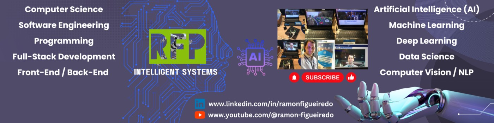

# Hi, I'm Ramon Figueiredo 👋

**Senior Software Engineer @ Sony** · Vancouver, BC, Canada · Computer Scientist (BSc, MSc) · PhD in Software Engineering (Applied AI)

-brightgreen?style=flat-square)

🌐 **Homepage:** [ramonfigueiredo.github.io](https://ramonfigueiredo.github.io)

---

## 👨‍💻 About me

I'm a Senior Software / AI Engineer designing and delivering high-performance, scalable systems across industries, including Film/VFX/Animation, Consulting/Technology, Sports and Biomechanics, Finance, Healthcare, Consumer Electronics, Telecommunications, Mining and Steel, University Education, and Data Management and Analytics.

Over nearly two decades, I've built and deployed AI and enterprise systems that combine computer vision, machine learning, NLP, and generative AI with large-scale backend, data, and infrastructure engineering.

In addition to industry work, I have a strong academic foundation: 2 years as a Computer Science Professor at two Brazilian universities (Pontifícia Universidade Católica de Minas Gerais (PUC Minas) and Centro Federal de Educação Tecnológica de Minas Gerais (CEFET-MG)), teaching 16 undergraduate courses spanning Software Engineering, Programming (C, Java, C++), Digital Image Processing, Compilers, Graph Theory, Web and Database Technologies, Requirements Engineering, Software Testing and Maintenance, and Capacity Planning and Evaluation of Computer Systems.

I'm passionate about solving complex problems, optimizing performance, and applying cutting-edge AI to create intelligent, scalable systems that bring real value. Always open to networking, collaborations, and opportunities in AI, computer vision, and system engineering at scale.

**Signature work:**
- 🎬 Engineering contributions at Sony Pictures Imageworks on productions including *K-Pop Demon Hunters* (2× Oscars, 2× Golden Globes, 10× Annie Awards, 2× Critics Choice), *In Your Dreams* (2025), and *GOAT* (2026).
- 🏆 **2025 SPI Innovation Award** for engineering contributions at Sony Pictures Imageworks.
- 🏅 PhD research with Institut national du sport du Québec × Own The Podium × Diving Canada applying CV/ML to Olympic dive performance.
- 📷 M.Sc. research (UFMG × LG Electronics) on low-cost content-based image retrieval.

---

### 🚀 Roles I'm interested in

- 💼 **Roles:** Senior Software Engineer · Senior AI Engineer · Senior ML Engineer · Staff Software Engineer · Software Engineering Manager · Principal Software Engineer · Director of Software Engineering
- 💬 **Topics & expertise:**
  - **AI / ML / CV:** Artificial Intelligence, Machine Learning, Deep Learning, Computer Vision, Natural Language Processing (NLP), Generative AI, model deployment, recommender systems, information retrieval
  - **Backend & distributed systems:** Large-scale, high-performance, scalable backends; microservices; API design (REST, gRPC, GraphQL); asynchronous and concurrent programming
  - **Data & big data:** SQL and NoSQL databases (PostgreSQL, Oracle, MongoDB, Cassandra, ElasticSearch), data pipelines, Apache Spark, Hadoop, Kafka
  - **Cloud & DevOps:** AWS, GCP, Azure, Docker, Kubernetes, OpenShift, ArgoCD, Jenkins, CI/CD
  - **Applied domains:** VFX / animation / film pipelines at scale, sports biomechanics & performance analytics, image & video processing, full-stack web development
  - **Software engineering & leadership:** architecture, performance optimization, TDD, software maintenance, requirements engineering, mentoring and leading engineers
- 📫 **Reach me via** [LinkedIn](https://www.linkedin.com/in/ramonfigueiredo/)

---

## 🎓 Education

- **Ph.D., Software and IT Engineering**: Université du Québec, École de technologie supérieure (ÉTS) · Computer Vision · Artificial Intelligence · Research with Institut national du sport du Québec, Mitacs, Own The Podium, and Diving Canada on CV/ML for sports performance analysis.
- **M.Sc., Computer Science**: Universidade Federal de Minas Gerais (UFMG), Brazil (2015) · Computer Vision · Artificial Intelligence · Content-based image retrieval (UFMG × LG Electronics).
- **B.Sc., Computer Science**: Pontifícia Universidade Católica de Minas Gerais (PUC Minas), Brazil (2011) · SBC Student Highlight Award nominee · Honorable mention for undergrad thesis on face detection & tracking.

---

## 🎬 Open Source Leadership: OpenCue (ASWF)

**Technical Steering Committee (TSC) member** for [OpenCue](https://github.com/AcademySoftwareFoundation/OpenCue) under the [Academy Software Foundation (ASWF)](https://www.aswf.io/), helping guide technical strategy, code reviews, and project management. OpenCue is the open-source render-management system used across the VFX and animation industry.

📖 **Documentation:** [docs.opencue.io](https://docs.opencue.io/)

### 📊 My OpenCue contributions (live)

<table>
  <tr>
    <td>
      
    </td>
    <td>
      
    </td>
  </tr>
</table>

**Quick links to my contributions:**

- 📝 [Authored PRs](https://github.com/AcademySoftwareFoundation/OpenCue/pulls?q=is%3Apr+author%3Aramonfigueiredo)
- ✅ [Merged PRs](https://github.com/AcademySoftwareFoundation/OpenCue/pulls?q=is%3Apr+author%3Aramonfigueiredo+is%3Amerged)
- 👀 [PRs I've reviewed](https://github.com/AcademySoftwareFoundation/OpenCue/pulls?q=is%3Apr+reviewed-by%3Aramonfigueiredo)
- 🐛 [Issues I've opened](https://github.com/AcademySoftwareFoundation/OpenCue/issues?q=is%3Aissue+author%3Aramonfigueiredo)
- 💾 [My commits](https://github.com/AcademySoftwareFoundation/OpenCue/commits?author=ramonfigueiredo)

---

## 🏆 Selected highlights

Full list on my homepage: [Honors & Awards](https://ramonfigueiredo.github.io/#awards) · [Film & Animation Credits](https://ramonfigueiredo.github.io/#filmography) · [Press & Media](https://ramonfigueiredo.github.io/#press-media)

- 🥇 **SPI Innovation Award (2025)**: Sony Pictures Imageworks.
- 🎬 **TSC member** for [OpenCue](https://github.com/AcademySoftwareFoundation/OpenCue) under the Academy Software Foundation (ASWF): Helping guide technical strategy for the VFX industry's open-source render-management system.
- 🎬 **Film & animation credits (selection):** *K-Pop Demon Hunters* (2025), 2× Oscars · 2× Golden Globes · 10× Annie Awards · 2× Critics Choice; *In Your Dreams* (2025); *GOAT* (2026).
- 📰 Featured in Pontifícia Universidade Católica de Minas Gerais (PUC Minas), Universidade Federal de Minas Gerais (UFMG), Radio-Canada, *O Tempo*, and more.
- 🎓 SBC Student Highlight Award nominee · Honorable mention (undergraduate dissertation).

---

## 📚 Publications

  

Full list on my homepage: [Publications](https://ramonfigueiredo.github.io/#publications)

Peer-reviewed work across **SIBGRAPI, CIARP, SBSeg, SPIN, and WEAC**. Selected:

- **Automatic Marker-less Kinematic Analysis of Diving and Diver's 2D Pose**, SPIN 2022 (Canadian Sport Science and Sports Innovation Conference, Vancouver, BC). Computer vision and machine learning applied to Olympic-level dive performance (with Institut national du sport du Québec × Diving Canada).
- **Automatic Extraction of Measurements in Echocardiogram Examinations**, SIBGRAPI 2017. Medical imaging and deep learning for cardiology.
- **Low-Cost Visual Feature Representations for Image Retrieval**, SIBGRAPI 2016. Content-based image retrieval with efficient visual descriptors.
- **An Experimental Comparison of Feature Extraction and Distance Metrics for Image Retrieval**, SIBGRAPI 2015. Benchmarking of image descriptors and similarity metrics.
- **A Study on Low-Cost Representations for Image Feature Extraction on Mobile Devices**, CIARP 2015. Efficient on-device visual feature extraction.
- **Low-Cost Visual Feature Representations for Image Retrieval**, M.Sc. dissertation, UFMG (2015). Content-based image retrieval for consumer electronics (UFMG × LG Electronics).
- **NPDI Find Porn: Uma Ferramenta para Detecção de Conteúdo Pornográfico**, SBSeg 2014. Automatic adult-content detection in videos and images.
- **PS-CAS MIPS: Um simulador de pipeline do processador MIPS 32 bits**, WEAC 2009. Educational simulator for MIPS 32-bit processor pipeline architecture.

---

## 💻 Tech Stack

### Languages and Technologies

### Frameworks and Libraries

### Tools and Platforms

  
<b>Full list (languages, frameworks, databases, cloud, DevOps, and more)</b>

- **Languages:** Python · Java · C · C++ · Go · Rust · Swift · JavaScript · TypeScript · Scala · PHP · Ruby · Perl · C# · .NET · R · Matlab · Scilab · Octave
- **AI / ML / Data Science:** TensorFlow · PyTorch · Keras · Scikit-Learn · OpenCV · Caffe · Computer Vision · NLP · Deep Learning · Generative AI · Recommender Systems · Information Retrieval · Image & Video Processing
- **Backend & Web Frameworks:** Django · Flask · FastAPI · Spring Framework · Spring Boot · Spring Batch · Spring Integration · Spring REST · Spring HATEOAS · Spring Security · Java EE / J2EE · Hibernate · Node.js · Express · JSP · JSF · Servlets · EJB · Struts · ZIO
- **Frontend:** React · Redux · Next.js · Angular · AngularJS · Vue.js · jQuery · HTML5 · CSS3 · Bootstrap · GWT · SmartGWT
- **Mobile / Desktop / UI:** iOS · Android · macOS · PySide · PyQt
- **Databases & Storage:** PostgreSQL · Oracle Database · MySQL · Microsoft SQL Server · MongoDB · Cassandra · HBase · ElasticSearch · Flyway · SQL · NoSQL · Object Storage
- **Big Data & Messaging:** Apache Spark · Hadoop · Apache Kafka · RabbitMQ · Apache MINA · Apache Felix · OSGi
- **Cloud:** AWS · GCP · Microsoft Azure
- **DevOps / Infrastructure / CI-CD:** Docker · Kubernetes · OpenShift · ArgoCD · Jenkins · CI/CD · Microservices · Containers
- **Build & Package Tools:** Maven · Ant · Gradle · npm · yarn · pip · pipenv
- **Version Control & Collaboration:** Git · GitHub · GitLab · Bitbucket · SVN · JIRA · Confluence
- **Operating Systems:** Linux · Ubuntu · CentOS · Rocky Linux · macOS · Windows
- **Testing & Software Engineering:** Unit Testing · TDD · JUnit · Scrum · Design Patterns · Requirements Engineering · Software Testing & Maintenance
- **APIs / Protocols / Security:** REST · gRPC · GraphQL · WebSocket · JDBC · Web Services · OAuth · JWT · SSL/TLS · HTTPS
- **JVM Tooling:** HeapDumps · ThreadDumps · JStack · JMap · JVisualVM · JConsole

---

## 🎯 Featured open-source projects

Full list: [github.com/ramonfigueiredo?tab=repositories](https://github.com/ramonfigueiredo?tab=repositories).

> ℹ️ **Note:** many of my projects are kept private (work, research, and client repositories), so the public list below is only a small sample.

<table>
  <tr>
    <td>
      
    </td>
    <td>
      
    </td>
  </tr>
  <tr>
    <td>
      
    </td>
    <td>
      
    </td>
  </tr>
  <tr>
    <td>
      
    </td>
    <td>
      
    </td>
  </tr>
</table>

---

## 📊 GitHub stats

### 🏆 Trophies

### 📈 Activity graph

### 🗂 Profile summary

### 📊 Activity overview (contribution breakdown)

<table>
  <tr>
    <td>
      
    </td>
    <td>
      
    </td>
  </tr>
  <tr>
    <td>
      
    </td>
    <td>
      
    </td>
  </tr>
</table>

### 📅 Contributions in the last year

See the live count, year picker, and full activity overview on my [GitHub profile](https://github.com/ramonfigueiredo).

### 🕒 Contribution activity (auto-updated daily)

Created commits, opened PRs and issues, reviewed PRs, and more. The list below is auto-refreshed every 24h with the 5 most recent public events:

<!--START_SECTION:activity-->
<!--END_SECTION:activity-->

For the full month-by-month timeline with year picker (2014 → present), visit my [GitHub profile](https://github.com/ramonfigueiredo).

### 🏢 Organizations I contribute to

---

> *Building intelligent, distributed systems where computer science, software engineering, and AI meet real-world impact.*
